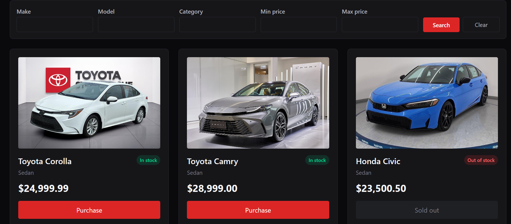
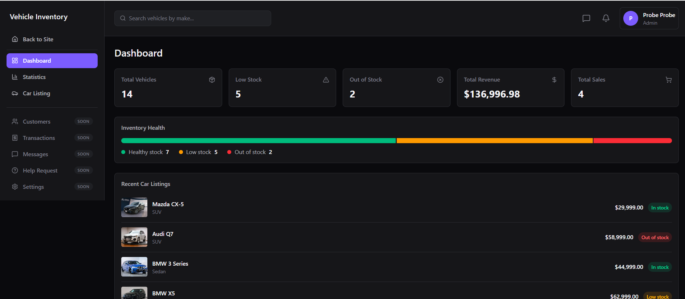
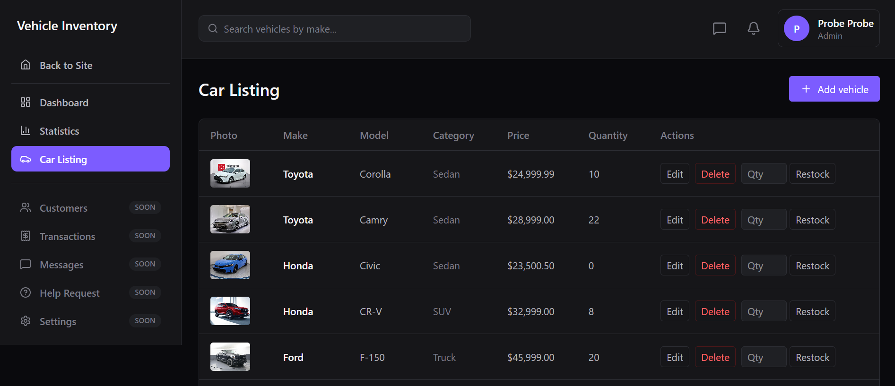

## This repository is maintained **only by me** (with AI assistance).

An AI tool accidentally introduced changes that appeared to attribute contributions incorrectly. Those unintended changes have been **completely removed**.

If GitHub still displays any unexpected contributor information, it is most likely due to **GitHub's caching or contribution graph update delay**, not because those changes still exist in the repository.

### Clarification

-  All code contributions in this repository are **my own**.
-  AI has been used **only as a development assistant** (for suggestions, reviews, explanations, and code generation under my direction).
-  No other person has contributed code to this repository.
-  The accidental attribution issue has been resolved by removing the unintended changes.

### Going Forward

To prevent this from happening again, I have adopted a strict workflow and policy to ensure that AI-assisted commits never introduce incorrect author or contributor information in this repository.

Thank you for your understanding.

# Car Dealership Inventory System

## Overview
A full-stack car dealership inventory management system: a RESTful API built with Spring Boot, paired with a React single-page app frontend. The system handles user management, role-based authentication, vehicle inventory tracking (with photo uploads), purchase processing, and an admin dashboard with inventory/sales analytics. The backend follows a robust layered architecture using modern Java practices, and the whole stack (Postgres, backend, frontend) is containerized for one-command local startup.

## Key Features
- **User Authentication & Authorization**: Secure API endpoints using Spring Security and JSON Web Tokens (JWT), with role-aware routing on the frontend (`ADMIN` vs `USER`).
- **User Management**: Manage users and their roles, storing comprehensive profiles including addresses and driving license details.
- **Vehicle Inventory**: Track vehicle stock by make, model, category, and price, with photo uploads. Includes atomic operations to add and reduce stock, preventing negative inventory.
- **Search & Browse**: Public vehicle dashboard with filtering (make, model, category, min/max price) and pagination.
- **Purchase Processing**: Record transactions linking users to vehicle purchases, tracking historical pricing and quantities, with a stock-capped purchase flow in the UI.
- **Admin Dashboard**: A dedicated admin shell for vehicle CRUD/restock and high-level inventory & sales analytics (total revenue, low-stock alerts, most purchased vehicle).

## Tech Stack

**Backend**
- **Language**: Java 17
- **Framework**: Spring Boot
- **Database**: PostgreSQL
- **Persistence**: Spring Data JPA & Hibernate
- **Database Migrations**: Flyway
- **Object Mapping**: MapStruct
- **Boilerplate Reduction**: Lombok
- **Security**: Spring Security & `jjwt`
- **Build Tool**: Maven
- **Testing**: JUnit 5, Mockito, & Testcontainers (for reliable database integration tests)

**Frontend**
- **Library**: React (Vite)
- **Styling**: Tailwind CSS
- **Routing**: `react-router-dom`
- **HTTP**: native `fetch` (no axios) via a small hand-rolled API client
- **State**: React Context/state (no Redux)

**Infrastructure**
- **Containerization**: Docker & Docker Compose (Postgres + Spring Boot backend + nginx-served frontend, with nginx reverse-proxying `/api/*` and `/images/*` to the backend)

## Project Structure

**Backend** (`backend/src/main/java/.../`) follows a standard layered architecture:
- `controller/`: REST API endpoints handling HTTP requests.
- `service/`: Core business logic layer.
- `repository/`: Spring Data JPA interfaces for database interaction.
- `entity/`: JPA domain models (`User`, `Vehicle`, `Purchase`, etc.).
- `dto/`: Data Transfer Objects for client-server communication.
- `mapper/`: MapStruct interfaces for converting between Entities and DTOs.
- `security/`: JWT filters, authentication providers, and security configurations.
- `validation/`: Custom validation constraints and logic.
- `exception/`: Global exception handling (e.g., `InsufficientStockException`).

**Frontend** (`frontend/src/`):
- `api/`: `fetch`-based client + one module per resource (`auth`, `vehicles`, `purchases`, `stats`).
- `pages/`: Route-level views (`HomePage`, `VehiclesPage`, `LoginPage`, `RegisterPage`, `AdminOverviewPage`, `AdminVehiclesPage`, `AdminStatsPage`).
- `layouts/`: `PublicLayout` (navbar + outlet) and `AdminLayout` (sidebar/topbar + outlet).
- `routes/`: `ProtectedRoute` and `AdminRoute` guards based on `AuthContext`.
- `context/`: `AuthContext` — token/role/fullName persisted to `localStorage`.
- `components/`: Shared UI (vehicle cards/grid, search/pagination, modals, toasts, stat cards).

## Screenshots

**Home** — landing page with featured listings:


**Vehicle Dashboard (public listing)** — browse and search live inventory, with stock-aware "Purchase" buttons:



**Admin: Dashboard** — inventory health and sales analytics at a glance (Admin only):



**Admin: Car Listing** — inline edit, delete, and restock controls (Admin only):



## Getting Started

### Prerequisites
- JDK 17
- Node.js 20+ (only for running the frontend outside Docker)
- Docker and Docker Compose

### Local Development Setup

1. **Start the Database**
   The project includes a root-level `docker-compose.yml` to quickly spin up a PostgreSQL instance. It publishes Postgres on host port `5433` (not the default `5432`) so it doesn't clash with a locally installed Postgres.
   ```bash
   docker-compose up -d db
   ```
   If you run the backend natively against this container (step 3), override the datasource URL to match: `SPRING_DATASOURCE_URL=jdbc:postgresql://localhost:5433/inventory_db` (PowerShell: `$env:SPRING_DATASOURCE_URL = "jdbc:postgresql://localhost:5433/inventory_db"`). Skip this if you're pointing at your own local Postgres install on `5432` instead.

2. **Set required environment variables**
   The app reads its JWT signing key from `JWT_SECRET` (`backend/src/main/resources/application.yml`) — there is no default, so the app won't boot without it. It must be **base64-encoded** (it's decoded as a key, not used as raw text). Generate one and export it before running natively:
   ```bash
   openssl rand -base64 32
   export JWT_SECRET=<paste generated value>   # PowerShell: $env:JWT_SECRET = "<value>"
   ```
   (This is only needed when running the backend directly via `mvnw`/step 3 below — `docker-compose up -d` in step 4 already sets `JWT_SECRET` for the containerized app.)

3. **Run the Backend**
   Use the included Maven wrapper to start the Spring Boot application.
   ```bash
   cd backend
   ./mvnw spring-boot:run
   ```
   The application will automatically connect to the local PostgreSQL database, apply Flyway migrations, and start on port `8080`.

   To run the frontend against it, in a separate terminal:
   ```bash
   cd frontend
   npm install
   npm run dev
   ```
   The SPA starts on port `5173` and talks to the backend at `http://localhost:8080` (`frontend/.env` → `VITE_API_BASE_URL`).

4. **Run via Docker Compose (Full Stack)**
   Alternatively, run the database, backend, and frontend together as containers from the project root:
   ```bash
   docker-compose up -d --build
   ```
   - Backend: `http://localhost:8081` (published on `8081`, not `8080`, to avoid clashing with a natively-running backend)
   - Postgres: `localhost:5433`
   - Frontend: `http://localhost:3000` — served by nginx, which also reverse-proxies `/api/*` to the backend container over the internal Docker network (`backend:8080`), so the browser never makes cross-origin calls and never needs the `8081` mapping directly.

## Testing
This project embraces Test-Driven Development (TDD) with isolated, fast-running tests. Persistence layer tests are backed by Testcontainers for true database verification without mocking the database engine.

Run the test suite using:
```bash
cd backend
./mvnw test
```

## API Documentation

### Authentication (`/api/auth`)
* `POST /api/auth/login`: Authenticate a user and return a JWT token.
* `POST /api/auth/register`: Register a new user account.

### Vehicles (`/api/vehicles`)
* `GET /api/vehicles`: Get a paginated list of all vehicles.
* `GET /api/vehicles/search`: Search vehicles using filters (e.g., make, category, min/max price) with pagination.
* `POST /api/vehicles`: Create a new vehicle in the inventory. (Admin only)
* `PUT /api/vehicles/{id}`: Update an existing vehicle's details. (Admin only)
* `DELETE /api/vehicles/{id}`: Delete a vehicle from the inventory. (Admin only)
* `POST /api/vehicles/{id}/restock`: Increase the stock quantity of a specific vehicle. (Admin only)

### Purchases (`/api/purchases`)
* `POST /api/purchases`: Process a vehicle purchase for the authenticated user, automatically reducing inventory stock.

### Dashboard Statistics (`/api/admin/stats`)
* `GET /api/admin/stats/inventory`: Retrieve aggregated inventory statistics (e.g., total vehicles, low stock items). (Admin only)
* `GET /api/admin/stats/sales`: Retrieve aggregated sales metrics (e.g., total revenue, most purchased vehicles). (Admin only)

### System (`/api`)
* `GET /api/health`: Basic health check endpoint returning system status.

## My AI Usage

This project was built in close collaboration with an AI coding assistant (Claude, Antigravity), under a strict, human-approved workflow defined in [`AGENTS.md`](AGENTS.md). Every AI-assisted change follows Test-Driven Development's Red → Green → Refactor cycle, and **every single phase required my explicit review and approval before the AI was allowed to commit** — nothing was auto-committed or auto-pushed. The full, unedited, chronological log of every prompt I gave the AI and every response it produced is kept in [`PROMPTS.md`](PROMPTS.md); this section is a summary of that log, not a replacement for it.

### What the AI was used for

- **Backend (Spring Boot)** — Every story (project scaffolding, `User`/`Role`/`UserRepository`, registration + BCrypt hashing, JWT authentication, `Vehicle` CRUD, search/filter specifications, restocking, `Purchase` processing with optimistic locking, inventory/sales analytics endpoints, image uploads) was implemented with the use of AI one TDD phase at a time: it wrote failing tests first (RED), the minimum code to pass them (GREEN), then refactored under my direction (REFACTOR — e.g. introducing MapStruct mappers, extracting a `StockService`, moving to DTO-only controller responses so JPA entities are never serialized directly, decoupling `UserDetails` into a dedicated `CustomUserDetails`).
- **Frontend (React + Vite + Tailwind)** — I had the AI to implement it end-to-end: the API client layer, auth context/route guards, the public vehicle dashboard with search and pagination, the purchase flow, and the admin shell (vehicle management table, restock/edit/delete, and the inventory/sales stats dashboard).
- **Infrastructure** — Dockerizing both services, writing the multi-stage `Dockerfile`s and the root `docker-compose.yml`, configuring the nginx reverse proxy so the browser only ever talks same-origin, and diagnosing real issues along the way (a `*.war` vs `*.jar` Docker build bug, host port conflicts with a locally-running Postgres/backend, a stale Testcontainers artifact-id break).

### What I did, not the AI

- Reviewed and explicitly approved every RED/GREEN/REFACTOR phase before it was committed — the AI was never allowed to proceed or commit unilaterally.
- Made every scope, architecture, and design-tradeoff call (e.g., rejecting a premature `BaseAppException` abstraction, choosing the nginx reverse-proxy approach over opening CORS to the browser, choosing to remap Docker host ports rather than kill my locally-running services).
- Caught and corrected AI mistakes directly, including one case where copied-looking boilerplate made it into a commit — I had those commits identified and squashed out of history before pushing.
- Wrote this disclosure and curated which parts of `PROMPTS.md` are summarized here.

### Guardrails this repo enforces on AI usage

Defined in `AGENTS.md` and followed throughout: an originality policy (no reproducing code from tutorials/Stack Overflow/other repos verbatim), a testing policy (fast, isolated unit tests by default; `@DataJpaTest`/Testcontainers only for real persistence behavior; no incidental `@SpringBootTest`), a "smallest change necessary" implementation policy (no speculative abstractions or unrequested dependencies), and a commit policy requiring a truthful, per-commit AI-usage disclosure in every commit message.
